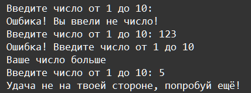
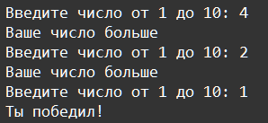

    Исключения: Задание 6 80 баллов
Напишите игру Угадай число. Программа рандомно генерирует число от 1 до 10, и предлагает пользователю это число угадать с 3-х попыток.

При вводе первой попытки, если число неверное, выдаётся подсказка – Ваше число больше (меньше). Для второй попытки делается тоже самое, а после третьей попытки, в случае неудачи выводит Удача не на твоей стороне, попробуй ещё!

Если число угадано в любой из попыток, то вывести Ты победил! и завершить программу.

Если было введено число вне диапазона, вывести Ошибка! Введите число от 1 до 10 причём ошибочный ввод тоже считается за попытку. В месте с сообщением выводится информация больше это число или меньше случайного.

