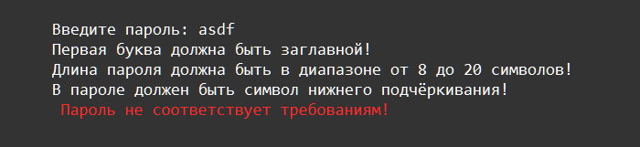
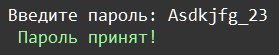
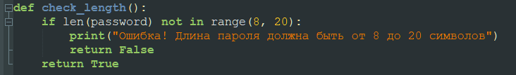

    Исключения: Задание 7 90 баллов
В системе авторизации для секретной страницы есть правила: пароль должен начинаться с заглавной латинской буквы, состоять из латинских букв, цифр, и нижнего подчёркивания, но заканчиваться только латинской буквой или цифрой; минимальная длина пароля — 8 символов, максимальная — 20. Напишите код, проверяющий соответствие входной строки этому правилу.

При неверном варианте вывести Пароль не соответствует требованиям! При правильном варианте вывести Пароль принят! Сделайте перехват всех возможных исключений.

Рекомендации по выполнению:

<b>Создайте для каждой проверки свою функцию подобного вида</b>

Функция будет возвращать значение False или True
Вам нужно будет создать список этих функций, а потом передать его в функцию all, которая и проверит, все ли функции в ней вернули True