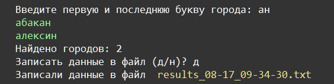

    Работа с файлами: Задание 3 25 баллов
Программа запрашивает у пользователя первую и последнюю букву и выводит все имена городов, которые соответствуют этому условию. Дальше программа спрашивает, записать ли данные в файл, если пользователь соглашается, пишем данные в файл results_<месяц-день_ЧЧ-ММ-СС>.txt

Для получения даты и времени используйте модуль time и его метод strftime