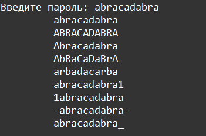

    Работа с файлами: Задание 4 50 баллов
Доработайте алгоритм из задание номер 5 урока Функции.

Мы открываем на запись файл passwords.txt и выполняем следующие действия: пользователь вводит пароль, если такой пароль уже есть, выводим сообщение и продолжаем запрашивать ввод.

Если пароля нет, добавляем его в разном написании

• В ВЕРХНЕМ регистре

• в нижнем регистре

• с Заглавной буквы

• с ЧеРеДуЮЩиМиСя буквами

• модаз дёрепан

• с единицей1 в конце

• с 1единице в начале

• с двумя -дефисами- в начале и в конце

• с нижним подчёркиванием_ в конце

Придумайте ещё 2 варианта записи. Добавляйте в файл только уникальные строки. После каждой итерации, отображаем количество строк в файле. Выход из программы осуществите по исключению KeyboardInterrupt.

