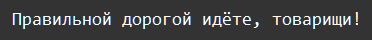

    Работа с файлами: Задание 5 50 баллов
Декодируйте строку

b'\xd0\x9f\xd1\x80\xd0\xb0\xd0\xb2\xd0\xb8\xd0\xbb\xd1\x8c\xd0\xbd\xd0\xbe\xd0\xb9
\xd0\xb4\xd0\xbe\xd1\x80\xd0\xbe\xd0\xb3\xd0\xbe\xd0\xb9
\xd0\xb8\xd0\xb4\xd1\x91\xd1\x82\xd0\xb5
\xd1\x82\xd0\xbe\xd0\xb2\xd0\xb0\xd1\x80\xd0\xb8\xd1\x89\xd0\xb8!\n'

и запишите её в файл decode.txt, выведите содержимое в консоли.

